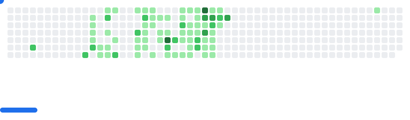
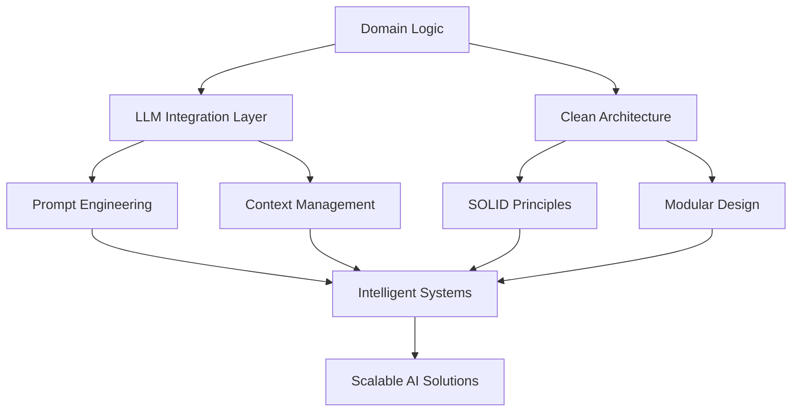

#  Hey there, I'm Alejandro!

<div align="center">
  
[](https://git.io/typing-svg)

</div>

<div align="center">
  
</div>

---
<div align="center">
  <picture>
    <source media="(prefers-color-scheme: dark)" srcset="images/breakout-dark.svg" />
    <source media="(prefers-color-scheme: light)" srcset="images/breakout-light.svg" />
    
  </picture>
</div>

<div align="center">

###  Quick Snapshot

</div>

<table align="center">
<tr>
<td align="center" width="50%">

**🎓 Currently Studying**  
Computer Engineering at UNED

**💡 Passionate About**  
Clean Architecture & Modern Tech

**🎯 Mission**  
Integrating LLMs with clean architecture

**🧠 Currently Learning**  
Domain-Driven LLM Integration

**📍 Location**  
Valencia, Spain

</td>
<td align="center" width="50%">

```javascript
const alejandro = {
    pronouns: "he/him",
    code: ["Python", "Go", "TypeScript", "Java"],
    architecture: ["Clean Code", "SOLID", "Modular"],
    currentFocus: "LLM Integration & Domain Logic",
    funFact: "I debug with print statements 🤫"
};
```

</td>
</tr>
</table>

---

<div align="center">

##  Tech Arsenal

</div>

<div align="center">

### Languages & Core Technologies


### AI/LLM


### Frameworks & Libraries


### Databases & Cloud


### IoT & Hardware


</div>

---

<div align="center">

##  GitHub Analytics

</div>

<div align="center">
  


</div>

<div align="center">
  
</div>

<div align="center">
  
</div>

---

<div align="center">

##  Software Philosophy

</div>

<div align="center">



</div>

<div align="center">
  <table>
  <tr>
  <td width="50%" valign="top">
  
  **🏗️ Architecture First**
  - Domain-driven design patterns
  - LLM abstraction layers
  - Clean separation of concerns
  - Dependency injection
  
  </td>
  <td width="50%" valign="top">
  
  **🤖 AI Integration Focus**
  - Prompt engineering strategies
  - Context-aware LLM responses
  - Domain knowledge embedding
  - Scalable AI workflows
  
  </td>
  </tr>
  </table>
</div>

---

<div align="center">

##  Let's Connect!

</div>

<div align="center">

[](mailto:albiolsafontalejandro@gmail.com)
[](https://www.linkedin.com/in/alejandro-albiol)
[](https://github.com/alejandro-albiol)

</div>

---

<div align="center">
  
###  Thanks for visiting!

*"Code is like humor. When you have to explain it, it's bad."* - Cory House


</div>

<div align="center">
  
</div>
